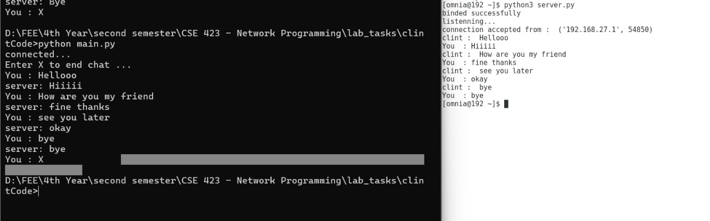
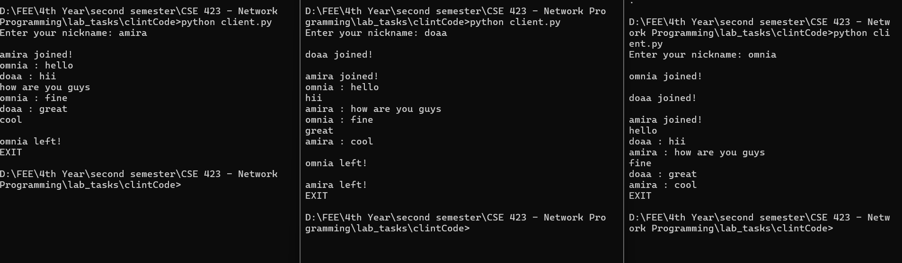

<<<<<<< HEAD
# Task 1 

#### Simple chat for receive and send messages 

#### Handel sending and receive measseges larger than 2048 Bytes

=======
# Task 2

####  chat Room for receiveing and sending messages between multiple useres at the same time 

>>>>>>> aa3e8173034d89b5b80600ac0cb0d7519f62fe32
