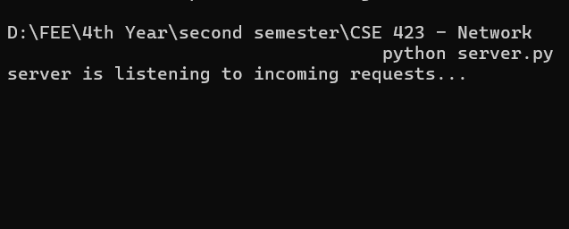
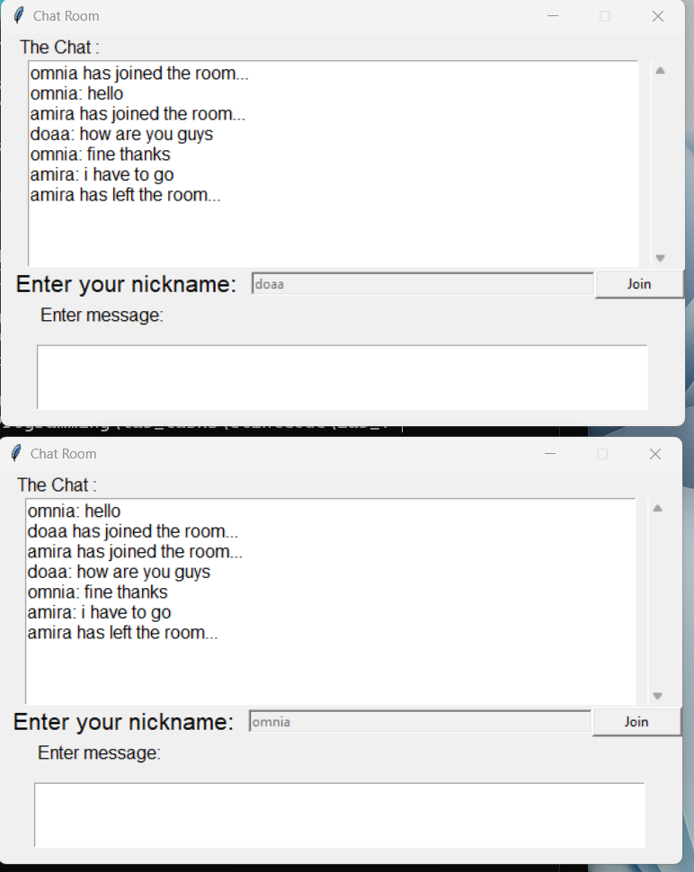

 
# A simple Python Real Time Chat Application with GUI interface 

### server running : 

 Run server file `python server.py`

  Run client file  `python client.py` you can run it as much as clients you want
	

  

	 

  

